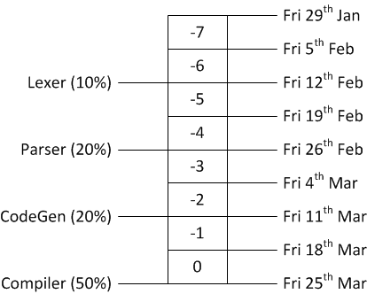

Overview
========

The main repository is at:
[https://github.com/LangProc/langproc_2015_cw](https://github.com/LangProc/langproc_2015_cw).

The language processors coursework is to build a C compiler
from the C90 language to MIPS assembly. It should be possible
to assemble and link the output using existing tools and
execute it on a MIPS CPU.

There are three intermediate milestones, which are assessed
at a low weight and designed to encourage familiarity with
aspects of language processors and implementation. There
is a more detailed discussion of the [rationale here](rationale.md).

The marks break-down is:

1 - [Tokeniser](1-tokeniser.md) : 10%, Due 12th Feb

2 - [Parser](2-parser.md) : 20%, Due 26th Feb

3 - [Code Generation](3-code-generator.md) : 20%, Due 11th March

4 - [Compiler](4-compiler.md) : 50%, Due Friday 25th March

The overall timeline is shown below:

It is not a good idea to assume that the final two weeks
are sufficient time to complete a compiler.

Environment
-----------

The target environment is the lab Ubuntu setup. You can
make use of any tools available there-in.

Build and filenames
-------------------

Your submission should contain a top-level makefile that
can build the various components, including your compiler.
All outputs will be built into the `bin/` directory. Apart
from that, you have complete freedom to do whatever you
want with directories and files.

